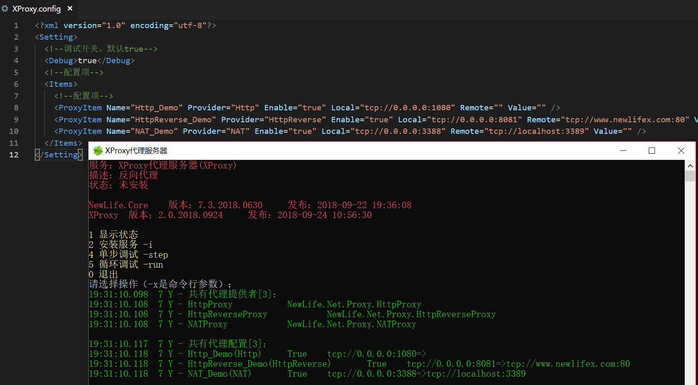

## XProxy代理服务器
XProxy是一个代理服务器宿主环境，可用于寄宿多种`ProxyBase`服务，主要是`NATProxy`反向代理。  

2005~2008期间，第一代XProxy同时也是第一代网络库，主要支持NAT、加解密、反向代理、直接代理、间接代理等，以Http代理缓存以及数据拦截修改为主。  
2018年v2.0，采用更成熟稳定且具有千万级吞吐的第三代网络库，主要支持反向代理，转发MySql、Oracle、Redis等。  

## 使用说明
双击启动`XProxy.exe`，自动生成配置文件`Config\XProxy.config`，默认如下：

XProxy支持单服务同时寄宿多个代理服务，配置文件的Items下，每一行ProxyItem代表一个代理服务。  
以管理员运行`XProxy.exe`，可以选择把它安装成为Windows服务，并控制它的启动和停止。  

## 新生命开发团队
本应用作为[新生命开发团队](https://github.com/NewLifeX)2018年开源路线图的一部分，依赖库：
+ [X组件](https://github.com/NewLifeX/X)  
+ [NewLife.Net网络库](https://github.com/NewLifeX/NewLife.Net)  

QQ群：1600800  
博客：https://nnhy.cnblogs.com  
